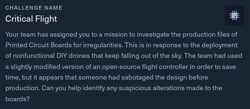

# Critical Flight

- Difficulty: Very Easy
- Files: [hw_critical_flight.zip](./hw_critical_flight.zip)

## Analysis

The folder downloaded have many files with the .gbr extension.
This extension is for Gerber format, a vector format for printed circuit board (PCB). All these images are the layers of a PCB.

Open these files in **gerbv**: `sudo apt install gerbv`

Now, we analyse each layer.

On the first layer, we can see the begin of the flag:

And the end of the flag:

> Flag: **HTB{533_7h3_1nn32_w02k1n95_0f_313c720n1c5#$@}**