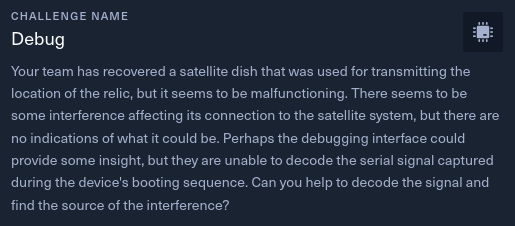
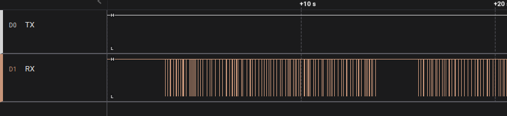
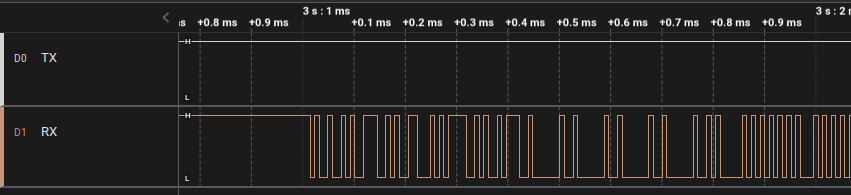
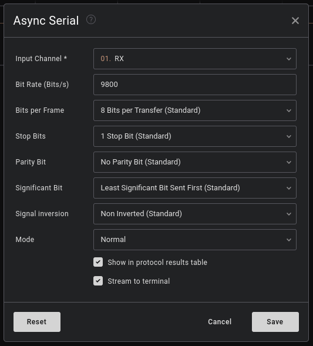
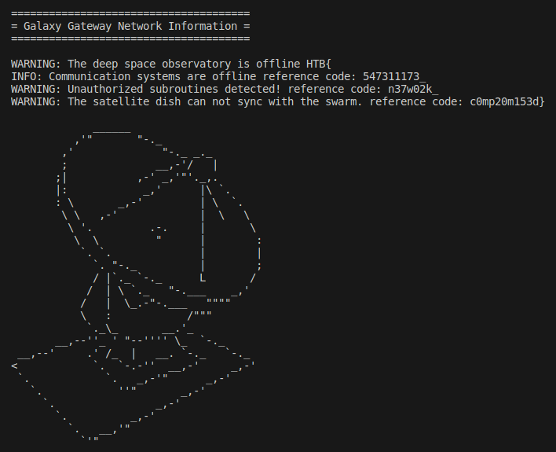

# Debug



- Difficulty: Easy
- Files: [hw_debug.zip](./hw_debug.zip)

## Analysis

Like the first hardware's challenge, we have a .sal file.

Let's open it with Logic2




When opening the file, we can see signals on RX (receiver) but nothing on TX (transmiter). It is probably a reception of debug messages (name of the challenge).

If we zoom in on a signal, we can see other variations, so we will analyze them.



On the Analyzers tab, we configure an analyze *Async Serial* with 9800 bauds(bits/s).



We can now see data. I have decided to export it and analyse it with python.

This is the output of Logic2:
```txt
Async Serial	data	0x49
Async Serial	data	0x4E
Async Serial	data	0x46
Async Serial	data	0x4F
Async Serial	data	0x3A
```

We have to extract the hex and convert it in ascii, my python code:
```py
with open("data.txt", "r") as f:
    data = f.readlines()
    debug = ""
    for line in data:
        debug += chr(int(line.split("	")[-1][2:], 16))
    print(debug)
```

After that we have all the debug messages :



The flag is split on the 4 lines of **Galaxy Gateway Network Information**.

> Flag: **HTB{547311173_n37w02k_c0mp20m153d}**