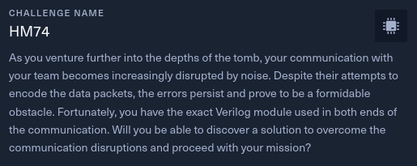

# HM74



- Difficulty: Medium
- Files: [hw_hm74.zip](./hw_hm74.zip)
- Server : IP:PORT

## Analysis

The file provided to us has a .sv extension, so it is a Verilog file.

```verilog
module encoder(
    input [3:0] data_in,
    output [6:0] ham_out
    );
 
    wire p0, p1, p2;
 
    assign p0 = data_in[3] ^ data_in[2] ^ data_in[0];
    assign p1 = data_in[3] ^ data_in[1] ^ data_in[0];
    assign p2 = data_in[2] ^ data_in[1] ^ data_in[0];
    
    assign ham_out = {p0, p1, data_in[3], p2, data_in[2], data_in[1], data_in[0]};
endmodule

module main;
    wire[3:0] data_in = 5;
    wire[6:0] ham_out;

    encoder en(data_in, ham_out);

    initial begin
        #10;
        $display("%b", ham_out);
    end
endmodule
```

There are two modules inside, a main and an encoder.

The encoder takes a 4-bit input data *data_in*, and returns a 7-bit data *ham_out*. It is in fact a **Hamming 4/7 encoding**. 

Now, let's see what the server sends us.

`nc $IP $PORT`

```
Captured: 01010001100000110010[...]
Captured: 10110001110001010010[...]
Captured: 10010001110100010010[...]
Captured: 10011001010001000000[...]
```

We notice that the server sends very long binary strings in loop and always different between them.
These strings are actually noisy, so the objective of this challenge is to use hamming decoding to correct the errors as much as possible by using the parity bits. 
I let you google for more details about this encoding / decoding.

Here is the hamming decoding function in python that I used:
```python
def hamming_decode(bits):
    # Computed the parity bits
    p0 = bits[0] ^ bits[2] ^ bits[4] ^ bits[6]
    p1 = bits[1] ^ bits[2] ^ bits[5] ^ bits[6]
    p2 = bits[3] ^ bits[4] ^ bits[5] ^ bits[6]

    # Determine the position of the error (if any)
    error_pos = p0 + p1 * 2 + p2 * 4 - 1

    # Correct the error if it is present
    if error_pos >= 0:
        return ""
    else:
        # Return the decoded data bits
        return "".join([str(bit) for bit in (bits[2], bits[4], bits[5], bits[6])])
```

Then, it is enough to cut the binary strings every 7 bits, to decode them to have 4 bits and to group on 8 bits to convert in ascii. By using a little analysis to get the right character in case of undetected error, we can determine the flag.

Flag: **HTB{hmm_w1th_s0m3_ana1ys15_y0u_c4n_3x7ract_7h3_h4mmin9_7_4_3nc_fl49}**