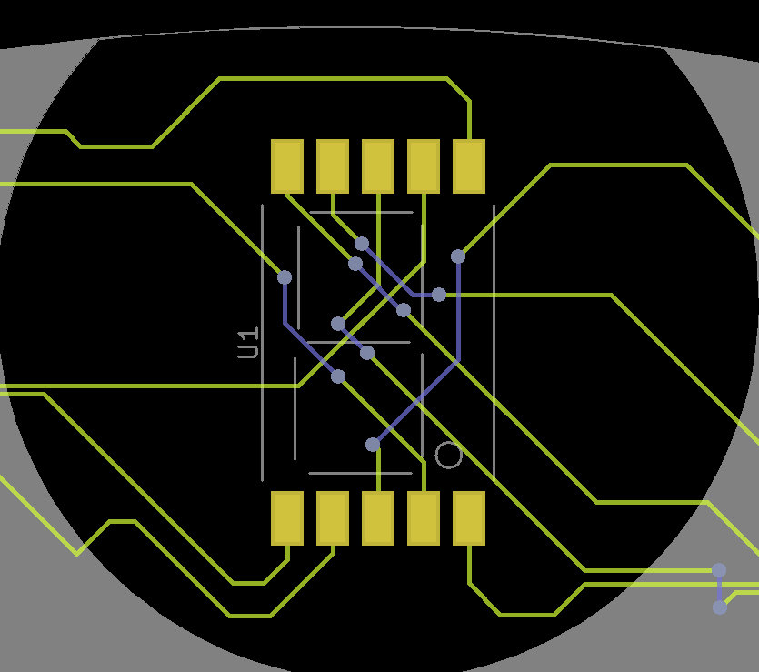

# Secret Code

- Difficulty: Easy
- Files: [hw_secret_code.zip](./hw_secret_code.zip)

## Analysis

Let's open the files.
There are a saleae file and a lot of gbr.

So we open the *saleae* file with **Logic2**.

There are 8 channels and the number 1 look like a clock.
Let's open all the PCB layer with **gerbv** to correlate it with these signals.

At this point we have unkown signals and a weird pcb, but we can see three elements, one on the center of the eye, one on the left and the other on the right. We have to zoom to analyse.

On the center, we can see a 7 segments display. So we can deduce that the signals ont the saleae file are the inputs of this display. We just have to know which signal is connected to which pin.

On the other two elements, you can see the numbering of the signals. Here are the different connections :

Now you just have to match these entries with the signals in the saleae file to see what is displayed. Then you get a hexadecimal string : 

"4854427b70307733325f63306d33355f6632306d5f77313768316e4021237"

Just decode this to get the flag.

> Flag: **HTB{p0w32_c0m35_f20m_w17h1n@!#}**