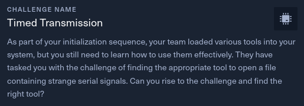
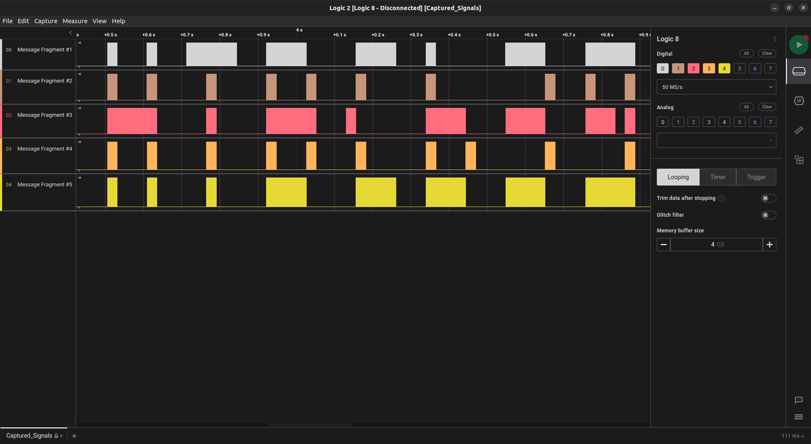

# Timed Transmission

- Difficulty: Very Easy
- Files: [hw_timed_transmission.zip](./hw_timed_transmission.zip)

## Analysis

The file for this challenge has a .sal extension.

After some searches on google, we found the software **Logic 2** from [Saleae](https://www.saleae.com/fr/). It is a logic analyzer for debugging electronic hardware.

Here, the signals directly form the letters of the flag. 

> Flag : **HTB{b391N_tH3_HArdWAr3_QU3St}**